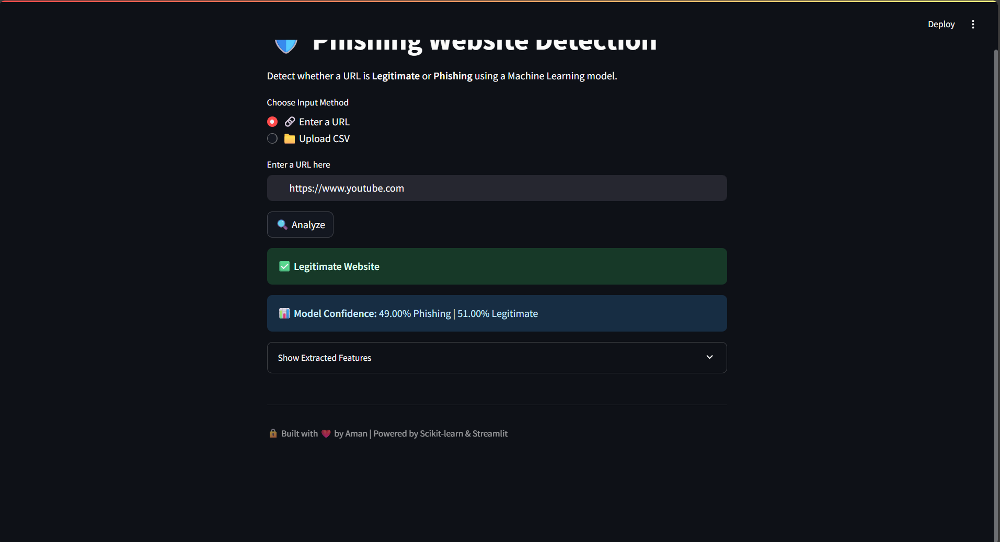
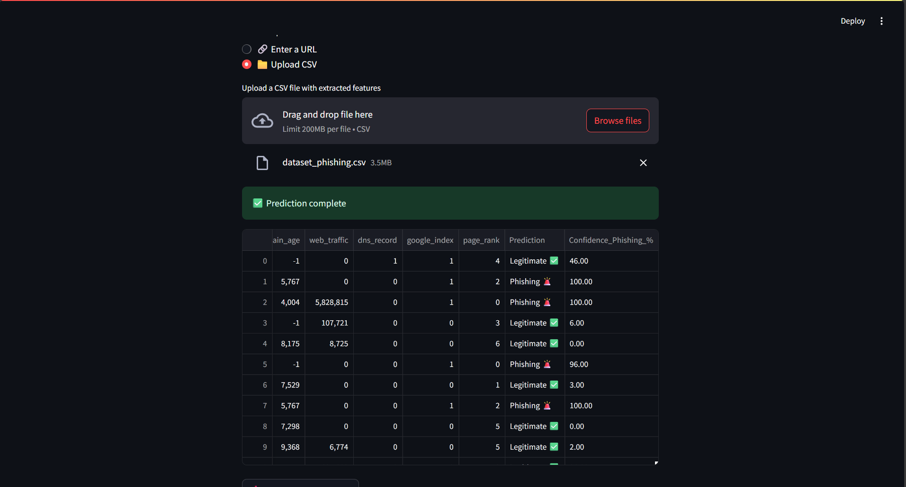

# Phishing_Detection

<h1 align="center">🛡️ Phishing Website Detection using Machine Learning</h1>

  
  
  

> ✅ Detect phishing websites in real-time using intelligent URL-based features and machine learning!  
> 🌐 Paste a link or 📁 upload a CSV — get predictions with confidence scores instantly!

---

## 🚀 Features

- 🔗 **Check any URL** for phishing in real time
- 📁 **Upload CSV files** with URLs or feature data
- 🤖 **ML-powered predictions** using over 80 extracted URL features
- 📊 **Confidence score** for each prediction
- 📥 **Downloadable results** in CSV format
- ⚡ Built with **Streamlit**, **scikit-learn**, and **Python**

---

## 🎯 Use Cases

- 🔒 Detect suspicious links before clicking
- 🧪 Test bulk URLs for research or analysis
- 🧑‍💻 Integrate phishing detection in cybersecurity tools

---

## 🧠 ML Workflow

| Step | Component |
|------|----------|
| 📂 Dataset | Labeled phishing & legitimate URLs |
| ⚙️ Feature Engineering | Extracted 80+ lexical & structural features |
| 🧼 Preprocessing | Cleaned, encoded, scaled with `StandardScaler` |
| 🔍 Model | Logistic Regression |
| 💾 Model Saved | `.pkl` files using `joblib` |
| 🖥️ Frontend | Streamlit interface for real-time detection |

---

## 📸 Screenshots

### 🔗 Real-time URL Check  

### 📁 CSV Upload Mode  

---

## 📁 Folder Structure

phishing-detection/
├── app.py # Streamlit app
├── phishing_model.pkl # Trained ML model
├── phishing_scaler.pkl # Scaler used in training
├── dataset_phishing.csv # Training dataset
├── requirements.txt # Python dependencies
└── README.md # Project documentation

